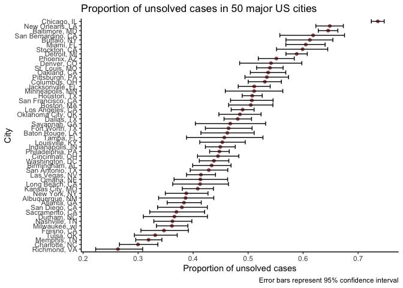
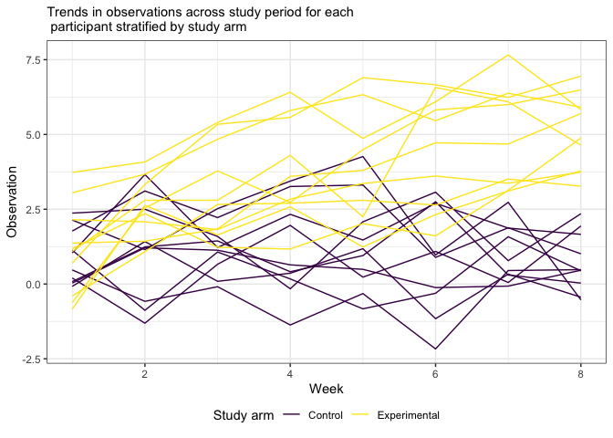
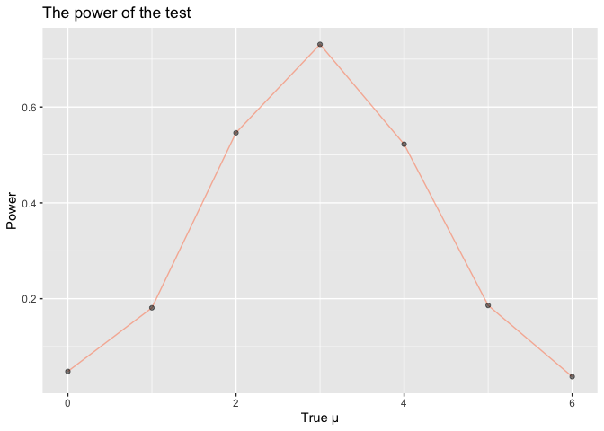
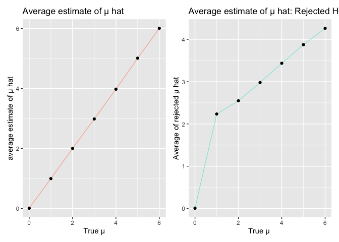

P8105 Homework5
================

``` r
library(tidyverse)
```

    ## ── Attaching packages ─────────────────────────── tidyverse 1.3.0 ──

    ## ✓ ggplot2 3.3.2     ✓ purrr   0.3.4
    ## ✓ tibble  3.0.3     ✓ dplyr   1.0.2
    ## ✓ tidyr   1.1.2     ✓ stringr 1.4.0
    ## ✓ readr   1.3.1     ✓ forcats 0.5.0

    ## ── Conflicts ────────────────────────────── tidyverse_conflicts() ──
    ## x dplyr::filter() masks stats::filter()
    ## x dplyr::lag()    masks stats::lag()

``` r
library(patchwork)
```

## Problem 1

  - Describe the raw data. Create a city\_state variable
    (e.g. “Baltimore, MD”) and then summarize within cities to obtain
    the total number of homicides and the number of unsolved homicides
    (those for which the disposition is “Closed without arrest” or
    “Open/No arrest”).

<!-- end list -->

``` r
homicide <- 
  read_csv("https://raw.githubusercontent.com/washingtonpost/data-homicides/master/homicide-data.csv") %>% 
  janitor::clean_names()
```

    ## Parsed with column specification:
    ## cols(
    ##   uid = col_character(),
    ##   reported_date = col_double(),
    ##   victim_last = col_character(),
    ##   victim_first = col_character(),
    ##   victim_race = col_character(),
    ##   victim_age = col_character(),
    ##   victim_sex = col_character(),
    ##   city = col_character(),
    ##   state = col_character(),
    ##   lat = col_double(),
    ##   lon = col_double(),
    ##   disposition = col_character()
    ## )

The Washington Post homicide dataset contains information on 52179
homicides across 50 major U.S. cities from 2007 to 2017. There are 12
variables. Variables provide information on the reported date of the
homicide, the victims name, age, race, gender, city, state, longitude,
latitude, and whether or not the case was solved.

``` r
homicide = 
  read_csv("https://raw.githubusercontent.com/washingtonpost/data-homicides/master/homicide-data.csv") %>% 
  mutate(
    city_state = str_c(city, state, sep = "_"),
    resolved = case_when(
      disposition == "Closed without arrest" ~ "unsolved",
      disposition == "Open/No arrest"        ~ "unsolved",
      disposition == "Closed by arrest"      ~ "solved",
    )
  ) %>% 
  select(city_state, resolved) %>% 
  filter(city_state != "Tulsa_AL")
```

    ## Parsed with column specification:
    ## cols(
    ##   uid = col_character(),
    ##   reported_date = col_double(),
    ##   victim_last = col_character(),
    ##   victim_first = col_character(),
    ##   victim_race = col_character(),
    ##   victim_age = col_character(),
    ##   victim_sex = col_character(),
    ##   city = col_character(),
    ##   state = col_character(),
    ##   lat = col_double(),
    ##   lon = col_double(),
    ##   disposition = col_character()
    ## )

  - For the city of Baltimore, MD, use the prop.test function to
    estimate the proportion of homicides that are unsolved; save the
    output of prop.test as an R object, apply the broom::tidy to this
    object and pull the estimated proportion and confidence intervals
    from the resulting tidy dataframe.

<!-- end list -->

``` r
aggregate_df = 
  homicide %>% 
  group_by(city_state) %>% 
  summarize(
    hom_total = n(),
    hom_unsolved = sum(resolved == "unsolved")
  )
```

    ## `summarise()` ungrouping output (override with `.groups` argument)

  - Now run prop.test for each of the cities in your dataset, and
    extract both the proportion of unsolved homicides and the confidence
    interval for each. Do this within a “tidy” pipeline, making use of
    purrr::map, purrr::map2, list columns and unnest as necessary to
    create a tidy dataframe with estimated proportions and CIs for each
    city.

<!-- end list -->

``` r
prop.test(
  aggregate_df %>% filter(city_state == "Baltimore_MD") %>% pull(hom_unsolved), 
  aggregate_df %>% filter(city_state == "Baltimore_MD") %>% pull(hom_total)) %>% 
  broom::tidy()
```

    ## # A tibble: 1 x 8
    ##   estimate statistic  p.value parameter conf.low conf.high method    alternative
    ##      <dbl>     <dbl>    <dbl>     <int>    <dbl>     <dbl> <chr>     <chr>      
    ## 1    0.646      239. 6.46e-54         1    0.628     0.663 1-sample… two.sided

``` r
results_df = 
  aggregate_df %>% 
  mutate(
    prop_tests = map2(.x = hom_unsolved, .y = hom_total, ~prop.test(x = .x, n = .y)),
    tidy_tests = map(.x = prop_tests, ~broom::tidy(.x))
  ) %>% 
  select(-prop_tests) %>% 
  unnest(tidy_tests) %>% 
  select(city_state, estimate, conf.low, conf.high)
```

  - Create a plot that shows the estimates and CIs for each city – check
    out geom\_errorbar for a way to add error bars based on the upper
    and lower limits. Organize cities according to the proportion of
    unsolved homicides.

<!-- end list -->

``` r
results_df %>% 
  mutate(city_state = fct_reorder(city_state, estimate)) %>% 
  ggplot(aes(x = city_state, y = estimate)) +
  geom_point(color = "#A35E60") + 
  geom_errorbar(aes(ymin = conf.low, ymax = conf.high)) + 
  labs(title = "Proportion of unsolved cases in 50 major US cities", 
       y = "Proportion of unsolved cases", 
       x = "City", 
       caption = "Error bars represent 95% confidence interval") + 
  theme(axis.text.x = element_text(angle = 90, vjust = 0.5, hjust = 1))
```

<!-- -->

# Problem 2

This zip file contains data from a longitudinal study that included a
control arm and an experimental arm. Data for each participant is
included in a separate file, and file names include the subject ID and
arm.

Create a tidy dataframe containing data from all participants, including
the subject ID, arm, and observations over time:

  - Start with a dataframe containing all file names; the list.files
    function will help.

<!-- end list -->

``` r
path_df = 
  tibble(
    path = list.files("./data")
  ) %>% 
  mutate(
    path = str_c("data/", path), 
    data = map(.x = path, .f = read_csv))
```

    ## Parsed with column specification:
    ## cols(
    ##   week_1 = col_double(),
    ##   week_2 = col_double(),
    ##   week_3 = col_double(),
    ##   week_4 = col_double(),
    ##   week_5 = col_double(),
    ##   week_6 = col_double(),
    ##   week_7 = col_double(),
    ##   week_8 = col_double()
    ## )
    ## Parsed with column specification:
    ## cols(
    ##   week_1 = col_double(),
    ##   week_2 = col_double(),
    ##   week_3 = col_double(),
    ##   week_4 = col_double(),
    ##   week_5 = col_double(),
    ##   week_6 = col_double(),
    ##   week_7 = col_double(),
    ##   week_8 = col_double()
    ## )
    ## Parsed with column specification:
    ## cols(
    ##   week_1 = col_double(),
    ##   week_2 = col_double(),
    ##   week_3 = col_double(),
    ##   week_4 = col_double(),
    ##   week_5 = col_double(),
    ##   week_6 = col_double(),
    ##   week_7 = col_double(),
    ##   week_8 = col_double()
    ## )
    ## Parsed with column specification:
    ## cols(
    ##   week_1 = col_double(),
    ##   week_2 = col_double(),
    ##   week_3 = col_double(),
    ##   week_4 = col_double(),
    ##   week_5 = col_double(),
    ##   week_6 = col_double(),
    ##   week_7 = col_double(),
    ##   week_8 = col_double()
    ## )
    ## Parsed with column specification:
    ## cols(
    ##   week_1 = col_double(),
    ##   week_2 = col_double(),
    ##   week_3 = col_double(),
    ##   week_4 = col_double(),
    ##   week_5 = col_double(),
    ##   week_6 = col_double(),
    ##   week_7 = col_double(),
    ##   week_8 = col_double()
    ## )
    ## Parsed with column specification:
    ## cols(
    ##   week_1 = col_double(),
    ##   week_2 = col_double(),
    ##   week_3 = col_double(),
    ##   week_4 = col_double(),
    ##   week_5 = col_double(),
    ##   week_6 = col_double(),
    ##   week_7 = col_double(),
    ##   week_8 = col_double()
    ## )
    ## Parsed with column specification:
    ## cols(
    ##   week_1 = col_double(),
    ##   week_2 = col_double(),
    ##   week_3 = col_double(),
    ##   week_4 = col_double(),
    ##   week_5 = col_double(),
    ##   week_6 = col_double(),
    ##   week_7 = col_double(),
    ##   week_8 = col_double()
    ## )
    ## Parsed with column specification:
    ## cols(
    ##   week_1 = col_double(),
    ##   week_2 = col_double(),
    ##   week_3 = col_double(),
    ##   week_4 = col_double(),
    ##   week_5 = col_double(),
    ##   week_6 = col_double(),
    ##   week_7 = col_double(),
    ##   week_8 = col_double()
    ## )
    ## Parsed with column specification:
    ## cols(
    ##   week_1 = col_double(),
    ##   week_2 = col_double(),
    ##   week_3 = col_double(),
    ##   week_4 = col_double(),
    ##   week_5 = col_double(),
    ##   week_6 = col_double(),
    ##   week_7 = col_double(),
    ##   week_8 = col_double()
    ## )
    ## Parsed with column specification:
    ## cols(
    ##   week_1 = col_double(),
    ##   week_2 = col_double(),
    ##   week_3 = col_double(),
    ##   week_4 = col_double(),
    ##   week_5 = col_double(),
    ##   week_6 = col_double(),
    ##   week_7 = col_double(),
    ##   week_8 = col_double()
    ## )
    ## Parsed with column specification:
    ## cols(
    ##   week_1 = col_double(),
    ##   week_2 = col_double(),
    ##   week_3 = col_double(),
    ##   week_4 = col_double(),
    ##   week_5 = col_double(),
    ##   week_6 = col_double(),
    ##   week_7 = col_double(),
    ##   week_8 = col_double()
    ## )
    ## Parsed with column specification:
    ## cols(
    ##   week_1 = col_double(),
    ##   week_2 = col_double(),
    ##   week_3 = col_double(),
    ##   week_4 = col_double(),
    ##   week_5 = col_double(),
    ##   week_6 = col_double(),
    ##   week_7 = col_double(),
    ##   week_8 = col_double()
    ## )
    ## Parsed with column specification:
    ## cols(
    ##   week_1 = col_double(),
    ##   week_2 = col_double(),
    ##   week_3 = col_double(),
    ##   week_4 = col_double(),
    ##   week_5 = col_double(),
    ##   week_6 = col_double(),
    ##   week_7 = col_double(),
    ##   week_8 = col_double()
    ## )
    ## Parsed with column specification:
    ## cols(
    ##   week_1 = col_double(),
    ##   week_2 = col_double(),
    ##   week_3 = col_double(),
    ##   week_4 = col_double(),
    ##   week_5 = col_double(),
    ##   week_6 = col_double(),
    ##   week_7 = col_double(),
    ##   week_8 = col_double()
    ## )
    ## Parsed with column specification:
    ## cols(
    ##   week_1 = col_double(),
    ##   week_2 = col_double(),
    ##   week_3 = col_double(),
    ##   week_4 = col_double(),
    ##   week_5 = col_double(),
    ##   week_6 = col_double(),
    ##   week_7 = col_double(),
    ##   week_8 = col_double()
    ## )
    ## Parsed with column specification:
    ## cols(
    ##   week_1 = col_double(),
    ##   week_2 = col_double(),
    ##   week_3 = col_double(),
    ##   week_4 = col_double(),
    ##   week_5 = col_double(),
    ##   week_6 = col_double(),
    ##   week_7 = col_double(),
    ##   week_8 = col_double()
    ## )
    ## Parsed with column specification:
    ## cols(
    ##   week_1 = col_double(),
    ##   week_2 = col_double(),
    ##   week_3 = col_double(),
    ##   week_4 = col_double(),
    ##   week_5 = col_double(),
    ##   week_6 = col_double(),
    ##   week_7 = col_double(),
    ##   week_8 = col_double()
    ## )
    ## Parsed with column specification:
    ## cols(
    ##   week_1 = col_double(),
    ##   week_2 = col_double(),
    ##   week_3 = col_double(),
    ##   week_4 = col_double(),
    ##   week_5 = col_double(),
    ##   week_6 = col_double(),
    ##   week_7 = col_double(),
    ##   week_8 = col_double()
    ## )
    ## Parsed with column specification:
    ## cols(
    ##   week_1 = col_double(),
    ##   week_2 = col_double(),
    ##   week_3 = col_double(),
    ##   week_4 = col_double(),
    ##   week_5 = col_double(),
    ##   week_6 = col_double(),
    ##   week_7 = col_double(),
    ##   week_8 = col_double()
    ## )
    ## Parsed with column specification:
    ## cols(
    ##   week_1 = col_double(),
    ##   week_2 = col_double(),
    ##   week_3 = col_double(),
    ##   week_4 = col_double(),
    ##   week_5 = col_double(),
    ##   week_6 = col_double(),
    ##   week_7 = col_double(),
    ##   week_8 = col_double()
    ## )

``` r
study_df = path_df %>% pull(data)
```

  - Tidy the result; manipulate file names to include control arm and
    subject ID, make sure weekly observations are “tidy”, and do any
    other tidying that’s necessary

<!-- end list -->

``` r
for (i in 1:20) {
  if (i < 11) {
    study_df[[i]] <- study_df[[i]] %>% 
    mutate(arm = "Control", 
           subject_id = i)
  } else if (i > 10) {
    study_df[[i]] <- study_df[[i]] %>% 
    mutate(arm = "Experimental", 
             subject_id = i - 10)
  }
}
```

``` r
result_study_df =
  bind_rows(study_df) %>% 
  gather(key = week, value = obs, week_1:week_8) %>% 
  arrange(week, subject_id) %>% 
  separate(col = week, into = c("delete", "week")) %>% 
  select(-delete)

head(result_study_df)
```

    ## # A tibble: 6 x 4
    ##   arm          subject_id week    obs
    ##   <chr>             <dbl> <chr> <dbl>
    ## 1 Control               1 1      0.2 
    ## 2 Experimental          1 1      3.05
    ## 3 Control               2 1      1.13
    ## 4 Experimental          2 1     -0.84
    ## 5 Control               3 1      1.77
    ## 6 Experimental          3 1      2.15

  - Make a spaghetti plot showing observations on each subject over
    time, and comment on differences between groups.

<!-- end list -->

``` r
result_study_df %>% 
  mutate(week = as.double(week), 
         subject_id = as.character(subject_id)) %>% 
  group_by(arm, subject_id) %>% 
  ggplot(aes(x = week, y = obs, color = arm, type = subject_id)) + 
    geom_line() + 
  theme_bw() + 
  labs(title = "Trends in observations across study period for each\n participant stratified by study arm",
       x = "Week", 
       y = "Observation") + 
  viridis::scale_color_viridis(name = "Study arm",
                               discrete = TRUE) + 
  theme(legend.position = "bottom", 
        legend.direction = "horizontal", 
        legend.box.spacing = unit(0.05, "cm"),
        plot.title = element_text(size = 11))
```

<!-- -->

## Problem 3

\-When designing an experiment or analysis, a common question is whether
it is likely that a true effect will be detected – put differently,
whether a false null hypothesis will be rejected. The probability that a
false null hypothesis is rejected is referred to as power, and it
depends on several factors, including: the sample size; the effect size;
and the error variance. In this problem, you will conduct a simulation
to explore power in a one-sample t-test.

  - First set the following design elements:

  - Fix n=30

  - Fix σ=5

  - Set μ=0. Generate 5000 datasets from the model

Repeat the above for μ={1,2,3,4,5,6}, and complete the following:

``` r
sim_ttest <- function(n = 30, sigma = 5, mu) {
  sim_data = 
    tibble(
    x = rnorm(n = 30, sd = 5, mean = mu)
    ) 

  sim_data %>% t.test() %>%
    broom::tidy()
  
}


sim_results = 
  rerun(10, sim_ttest(mu = 0)) %>% 
  bind_rows() %>% 
  select(estimate, p.value)


sim_results_df = 
tibble(mu = c(0, 1, 2, 3, 4, 5, 6)) %>% 
  mutate(
    output_lists = map(.x = mu, ~rerun(5000, sim_ttest(mu = .x))),
    estimate_dfs = map(output_lists, bind_rows)) %>% 
  select(-output_lists) %>% 
  unnest(estimate_dfs)
```

  - Make a plot showing the proportion of times the null was rejected
    (the power of the test) on the y axis and the true value of μ on the
    x axis. Describe the association between effect size and power.

<!-- end list -->

``` r
sim_results_df %>% 
  mutate(
    reject = ifelse(p.value < '0.05', 1, 0)
  ) %>% 
  group_by(mu) %>% 
  summarise(prop_reject = mean(reject)) %>% 
  ggplot(aes(x = mu, y = prop_reject)) + 
  geom_line(alpha = .5, color = "coral") + 
  geom_point(alpha = .5) +
  labs(
    title = "The power of the test",
    x = "True μ",
    y = "Power"
  )
```

    ## `summarise()` ungrouping output (override with `.groups` argument)

<!-- -->
We can tell from the plot that the effect size(x-axis) and the power of
test (y-axis) are positively correlated when true μ \<= 3. However,the
effect size(x-axis) and the power of test (y-axis) became negatively
correlated when true μ \> 3.

  - Make a plot showing the average estimate of μ̂ on the y axis and the
    true value of μ on the x axis. Make a second plot (or overlay on the
    first) the average estimate of μ̂ only in samples for which the null
    was rejected on the y axis and the true value of μ on the x axis. Is
    the sample average of μ̂ across tests for which the null is rejected
    approximately equal to the true value of μ? Why or why not?

<!-- end list -->

``` r
Plot_A = 
  sim_results_df %>% 
  mutate(
    reject = ifelse(p.value < '0.05', 1, 0)
  ) %>% 
  group_by(mu) %>% 
  summarise(mean_mu = mean(estimate)) %>% 
  ggplot(aes(x = mu, y = mean_mu)) +
  geom_line(alpha = .5, color = "coral") +
  geom_point() +
  labs(
    title = "Average estimate of μ hat",
    x = "True μ",
    y = "average estimate of μ hat"
  )
```

    ## `summarise()` ungrouping output (override with `.groups` argument)

``` r
Plot_B = 
  sim_results_df %>% 
  mutate(
    reject = ifelse(p.value < '0.05', 1, 0)
  ) %>% 
  filter(reject == 1) %>% 
  group_by(mu) %>% 
  summarise(mean_mu = mean(estimate)) %>% 
  ggplot(aes(x = mu , y = mean_mu)) +
  geom_line(alpha =.5, color = "turquoise") +
  geom_point() +
  labs(
    title = "Average estimate of μ hat: Rejected H0",
    x = "True μ ",
    y = "Average of rejected μ hat"
  )
```

    ## `summarise()` ungrouping output (override with `.groups` argument)

``` r
Plot_A + Plot_B
```

<!-- -->

The above plot shows the average estimate of μ hat on the y axis and the
true value of μ on the x axis (left) and the average estimate of μ hat
only in samples for which the null was rejected on the y axis and the
true value of μ on the x axis (right). We can tell from the plots that
the average estimates of μ hat are not the same. Both graphs show
positive correlation, however, the average estimate of μ hat in samples
for which the null was rejected is larger and the graph is steeper. The
sample average of μ hat across tests for rejected null isn’t
approximately equal to the true value of μ. The reason may due to the
increasing effect size.
