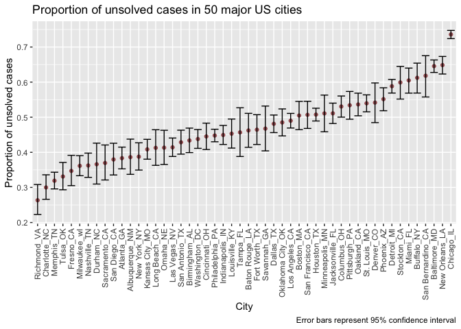

P8105 Homework5
================

``` r
library(tidyverse)
```

    ## ── Attaching packages ─────────────────────────── tidyverse 1.3.0 ──

    ## ✓ ggplot2 3.3.2     ✓ purrr   0.3.4
    ## ✓ tibble  3.0.3     ✓ dplyr   1.0.2
    ## ✓ tidyr   1.1.2     ✓ stringr 1.4.0
    ## ✓ readr   1.3.1     ✓ forcats 0.5.0

    ## ── Conflicts ────────────────────────────── tidyverse_conflicts() ──
    ## x dplyr::filter() masks stats::filter()
    ## x dplyr::lag()    masks stats::lag()

``` r
library(patchwork)
```

## Problem 1

  - Describe the raw data. Create a city\_state variable
    (e.g. “Baltimore, MD”) and then summarize within cities to obtain
    the total number of homicides and the number of unsolved homicides
    (those for which the disposition is “Closed without arrest” or
    “Open/No arrest”).

<!-- end list -->

``` r
murder <- 
  read_csv("https://raw.githubusercontent.com/washingtonpost/data-homicides/master/homicide-data.csv") %>% 
  janitor::clean_names()
```

    ## Parsed with column specification:
    ## cols(
    ##   uid = col_character(),
    ##   reported_date = col_double(),
    ##   victim_last = col_character(),
    ##   victim_first = col_character(),
    ##   victim_race = col_character(),
    ##   victim_age = col_character(),
    ##   victim_sex = col_character(),
    ##   city = col_character(),
    ##   state = col_character(),
    ##   lat = col_double(),
    ##   lon = col_double(),
    ##   disposition = col_character()
    ## )

The Washington Post homicide dataset contains information on 52179
homicides across 50 major U.S. cities from 2007 to 2017. There are 12
variables. Variables provide information on the reported date of the
homicide, the victims name, age, race, gender, city, state, longitude,
latitude, and whether or not the case was solved.

``` r
murder <- murder %>% 
  unite("city_state", c("city", "state"), sep = ", ")

# unsolved cases in a city
unsolved <- murder %>% 
  group_by(city_state) %>% 
  filter(disposition %in% c("Closed without arrest", 
                            "Open/No arrest")) %>% 
  summarize(unsolved = n()) 
```

    ## `summarise()` ungrouping output (override with `.groups` argument)

``` r
# sum of cases in a city
total_cases <- murder %>% 
  group_by(city_state) %>%
  summarize(total = n())
```

    ## `summarise()` ungrouping output (override with `.groups` argument)

``` r
# join previous data sets
all_cases <- left_join(unsolved, total_cases, by = "city_state")
```

  - For the city of Baltimore, MD, use the prop.test function to
    estimate the proportion of homicides that are unsolved; save the
    output of prop.test as an R object, apply the broom::tidy to this
    object and pull the estimated proportion and confidence intervals
    from the resulting tidy dataframe.

<!-- end list -->

``` r
prop_unsolved <- function(df) {

  # uses unsolved and total columns in data set
  city_unsolved <- prop.test(df$unsolved, df$total)
  
  # putting estimate and bounds in a nice data set
  broom::tidy(city_unsolved) %>% 
    select(estimate, conf.low, conf.high)
}

all_cases %>% 
  filter(city_state == "Baltimore, MD") %>% 
  prop_unsolved() %>% 
  mutate(estimate = round(estimate, 3), 
         conf.low = round(conf.low, 3), 
         conf.high = round(conf.high, 3)) %>% 
  rename(Estimate = estimate, 
         "Lower bound" = conf.low, 
         "Upper bound" = conf.high) %>% 
  knitr::kable()
```

| Estimate | Lower bound | Upper bound |
| -------: | ----------: | ----------: |
|    0.646 |       0.628 |       0.663 |

  - Now run prop.test for each of the cities in your dataset, and
    extract both the proportion of unsolved homicides and the confidence
    interval for each. Do this within a “tidy” pipeline, making use of
    purrr::map, purrr::map2, list columns and unnest as necessary to
    create a tidy dataframe with estimated proportions and CIs for each
    city.

<!-- end list -->

``` r
city_nest <- nest(all_cases, unsolved:total)
```

    ## Warning: All elements of `...` must be named.
    ## Did you want `data = c(unsolved, total)`?

``` r
prop_unsolved(city_nest$data[[1]])
```

    ## # A tibble: 1 x 3
    ##   estimate conf.low conf.high
    ##      <dbl>    <dbl>     <dbl>
    ## 1    0.386    0.337     0.438

``` r
#purrr::map(city_nest$data, prop_unsolved)

unsolved_city <- city_nest %>% 
  mutate(prop_unsolved = purrr::map(data, prop_unsolved)) %>% 
  unnest() %>% 
  rename(CI_low = conf.low, 
         CI_high = conf.high)
```

    ## Warning: `cols` is now required when using unnest().
    ## Please use `cols = c(data, prop_unsolved)`

  - Create a plot that shows the estimates and CIs for each city – check
    out geom\_errorbar for a way to add error bars based on the upper
    and lower limits. Organize cities according to the proportion of
    unsolved homicides.

<!-- end list -->

``` r
unsolved_city %>% 
  mutate(city_state = fct_reorder(city_state, estimate)) %>% 
  ggplot(aes(x = city_state, y = estimate)) + 
  geom_point(color = "#A35E60") + 
  geom_errorbar(aes(ymin = CI_low, ymax = CI_high)) + 
  coord_flip() + 
  labs(title = "Proportion of unsolved cases in 50 major US cities", 
       y = "Proportion of unsolved cases", 
       x = "City", 
       caption = "Error bars represent 95% confidence interval") + 
  theme_classic() 
```

<!-- -->
